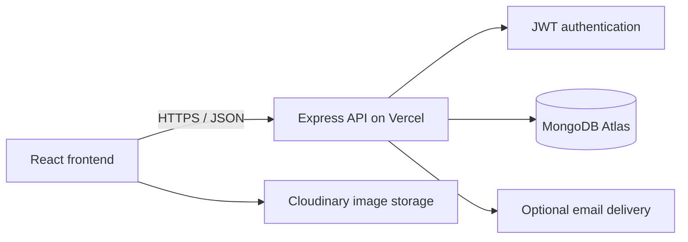

# Campus Connect

Campus Connect is a MERN marketplace for a campus community. Students can list used books, notes, art supplies, furniture, and other items, search listings, contact sellers, leave reviews, and manage their own listings.

[Live application](https://campus-connect-8pea.vercel.app/) · [Backend health](https://cc-backend-eta.vercel.app/health)

## Architecture



The frontend and backend are separate Vercel projects connected to the same GitHub repository. The backend validates bearer tokens, applies role and ownership checks, and talks to MongoDB through Mongoose. Public product responses omit seller email, phone number, and private address; signed-in users can request a seller contact email for a specific listing.

## Features

- Account registration and JWT-based login
- Searchable and paginated product listings
- Create, edit, review, and manage listings
- Image uploads through Cloudinary
- Admin views for users and products
- Protected seller contact information
- Health endpoint and graceful database error handling
- Responsive React Bootstrap interface

## Technology

- React 17, Redux, React Router, and React Bootstrap
- Node.js 22, Express, and Mongoose
- MongoDB Atlas
- Cloudinary
- Vercel

## Run locally

Requirements: Node.js 22 or newer and access to a MongoDB database.

1. Clone and install dependencies:

   ```bash
   git clone https://github.com/shivam0912/campus-connect.git
   cd campus-connect
   npm install
   npm install --prefix Frontend
   ```

2. Copy `backend/.env.example` to `backend/.env` and set at least:

   ```dotenv
   MONGO_URI=mongodb+srv://<user>:<password>@<cluster>/<database>
   JWT_SECRET=<long-random-secret>
   ALLOWED_ORIGINS=http://localhost:3000
   ```

   Email delivery is optional. Set `EMAIL_USER` and `EMAIL_PASSWORD` only if the server should send contact emails.

3. Point the frontend at the local API by creating `Frontend/.env.local`:

   ```dotenv
   REACT_APP_API_URL=http://localhost:5000
   ```

4. Start both applications:

   ```bash
   npm run dev
   ```

   The frontend runs at `http://localhost:3000`; the API runs at `http://localhost:5000`.

## Useful commands

```bash
npm start                    # start only the API
npm run server               # API with nodemon
npm run client               # start only the React app
npm run build --prefix Frontend
npm audit --omit=dev
npm audit --omit=dev --prefix backend
```

## API overview

| Endpoint | Access | Purpose |
| --- | --- | --- |
| `GET /` | Public | API status |
| `GET /health` | Public | API and database health |
| `GET /api/products` | Public | Paginated products without seller contact details |
| `GET /api/products/:id` | Public | One product without seller contact details |
| `GET /api/products/:id/contact` | Authenticated | Seller contact email for a listing |
| `POST /api/products` | Authenticated | Create a listing |
| `POST /api/users/login` | Public | Sign in and obtain a JWT |

## Deployment

The Vercel frontend project uses `Frontend` as its root directory. The backend project uses `backend`, reads secrets from Vercel environment variables, and routes requests through `backend/vercel.json`.

Required production variables:

- `MONGO_URI`
- `JWT_SECRET`
- `ALLOWED_ORIGINS=https://campus-connect-8pea.vercel.app`
- `NODE_ENV=production`
- `REACT_APP_API_URL=https://cc-backend-eta.vercel.app` in the frontend project

Never commit `.env` files or production credentials. Use Vercel environment variables and a restricted MongoDB database user.

## Security notes

- Passwords are hashed with bcrypt.
- JWT secrets and database credentials stay server-side.
- CORS is restricted to configured origins.
- Public product APIs redact seller contact data.
- Request bodies are size-limited and production errors omit stack traces.
- Production dependency audits currently report no known vulnerabilities for the backend dependency set.

## Authors

Shivam Gupta, Karthik Kumawat, Anmol Raykhare, and Swastik Rastogi.

